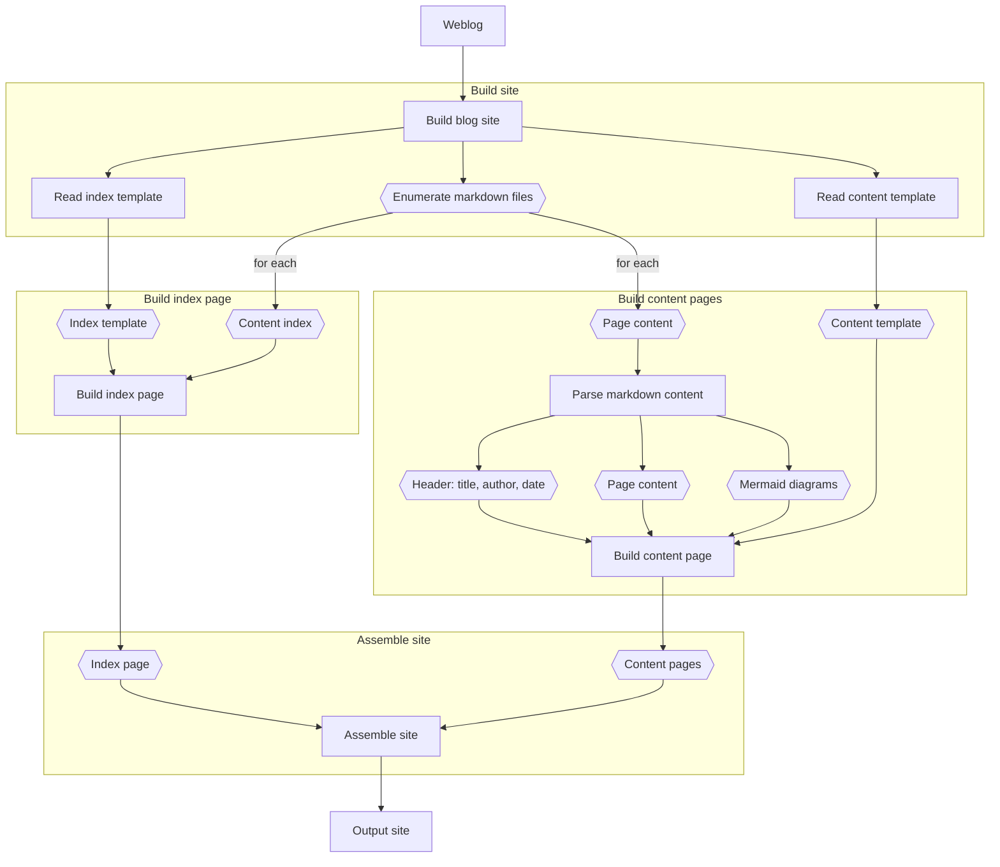

# MD Weblog

Builds a static blog site from markdown files that requires no JavaScript to
browse and supports mermaid diagrams embedded as svg.

## Version 1.0.0 Plans

*CAUTION*: This package is currently at version 0.5.0\
It will generate a static site, but quite a poor one. I am planning to get a
version 1.0.0 out within the next week or so. Until then, I'm publishing this
to test other workflows while I finish up the build.

## What is this, and why does it exist?

MDWeblog is a static site generator written in node.js. There are tons of
really great static site generators out there, so why did I build this?
Partially because I wanted more control over how content is generated. I knew
that I wanted support for mermaid diagrams, because mermaid is awesome. I also
wanted to use only html and ensure that no JavaScript was running on the site.

Mostly though, I built MDWeblog because building software is fun. I learn so
much by building utilities and I wanted to see what was involved in creating a
static site generator myself. It was a fun project and I learned a lot. Bonus:
I use it to generate my blog!

## Why not use [insert blog software here]?

I've been a WordPress user for years. They provide a fantastic framework for
building rich sites with tons of features. I couldn't hope to begin to build
a tenth of the features they provide.

Yet my needs and use for a blog have changed. I don't interact with others via
a blog anymore. I've never seen it as a source of revenue so I don't show ads.
It started as a place to share thoughts and as a repository for ideas and
notes, or write-ups of projects that held my interest.

I have relieved my blog of many of the duties it once performed, moving notes
to their own repository, images to my photo sharing site, social blurbs to
Twitter, and so on.

What I'd like to achieve with my blog today is very different than what I set
out to achieve when I wrote that first post over two decades ago. As my needs
have changed, I've gone seeking simpler tools that fit more closely with my
workflows.

## Architecture

Uses two html templates (one for index, another for a post) to build a static
HTML site from Markdown content. Apply whatever styling is necessary via CSS
in the template files. The content of posts, title, date, and author will be
replaced within the template file during generation. Very simple.

### Design

The following diagram illustrates the basic workflow used to assemble the blog
site.

### Libraries

This package uses the following amazing libraries:

* [Marked](https://www.npmjs.com/package/marked) - Used to parse the markdown
content and convert it to HTML.
* [MermaidJS](https://www.npmjs.com/package/mermaid) - Used to parse mermaid
diagram content and convert it to SVG.

The project uses other libraries, which you can see in the package.json file
within the repo. I wanted to call special attention to both marked and
mermaid because I think they are great!
